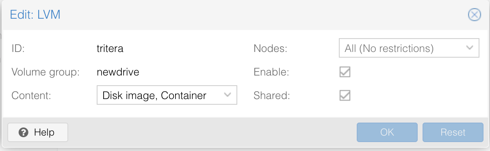

This post describes adding new hard disk to Proxmox node. Creating an LVM storage. Allocating a part of it to one of the virtual machines. Formatting it and using it under the VM

## Getting a list of hard disks

Go to the host console (though web interface or ssh).&nbsp; Do _lsblk_.
You will get the list of hard disk

`venkat@dellpve:~$ lsblk`  
`NAME MAJ:MIN RM SIZE RO TYPE MOUNTPOINT`  
`sda 8:0 0 465.8G 0 disk`  
`├─sda1 8:1 0 461.8G 0 part /`  
`├─sda2 8:2 0 1K 0 part`  
`└─sda5 8:5 0 4G 0 part [SWAP]`

## Partitioning the new hard disk

This helps to identify existing hard disks in the system. Shutdown the machine and install the new har d disk and reboot.

Run `lsblk`&nbsp;again and you will see a new entry, something like _sdb_. (you may also identify the new disk via web interface looking under _(your\_proxmox\_node) > Disks_. The new disk will show up as /dev/sdb).

Now in the console use _fdisk_ to create partition in the new disk.  
  
`venkat@dellpve:~$ sudo fdisk /dev/sdb`  
`[sudo] password for venkat:`

`Welcome to fdisk (util-linux 2.33.1).`  
`Changes will remain in memory only, until you decide to write them.`  
`Be careful before using the write command.`

`Command (m for help):`

Use &#8216;**n**&#8216; to create a new partition. Create a single partition. Accept defaults for the first and last sectors (to use the entire new hard disk), write changes to the partition table with &#8216;**w**&#8216; and quit. Now the new disk is ready and we can create LVM volume in it.<figure class="wp-block-image size-large">

## Creating LVM

`venkat@dellpve:~$ pvcreate /dev/sdb1`  
`Physical volume "/dev/sdb1" successfully created.`  

  
Create a Volume Group.  
  
`venkat@dellpve:~$ vgcreate newdrive /dev/sdb1`  
`Volume group "newdrive" successfully created`

Now, under the GUI, go to _(your\_proxmox\_node) > Storage > LVM_

Give a new name for the storage, select the appropriate volume group from the menu and **Add**. The new drive is added successfully and an LVM is created for use under nodes.<figure class="wp-block-image size-large">

## Using new storage in Virtual Machines

Under the GUI, choose the VM in which you want to use the new storage. Choose Hardware and choose Hard Disk under the dropdown menu Add. In the pop up window, choose the new disk under dropdown menu Storage. Enter the size of the storage in GB. Add. You will now see additional Hard Disk space allocated to the VM.

This storage is in LVM and so is still raw. You need to properly format it under the VM and mount it.

## Formatting and mounting the new storage in the VM

SSH to the VM. Check the availability of the new storage in the VM using _lsblk_. The output will show the new storage as _/sdb_ in the VM. But the size will be limited to that allocated as above. (_lsblk_ in the node will show the entire hard disk size).

Create the partition table&#8221;

`sudo parted /dev/sdb mklabel gpt`

Make it a primary partition, using the entire space:

`sudo parted -a opt /dev/sdb mkpart primary ext4 0% 100%`&nbsp;

This will create a new partition _sdb1_, ready to be formatted as ext4

Format it as _ext4_ file system:

`sudo mkfs.ext4 -L stream /dev/sdb1`

I have labelled the partition as <_stream_> in the above example. Next, I make a directory for video in it, mount it in _fstab_ by editing _/etc/fstab_ and mount all.

`sudo mkdir -p /mnt/video`  
`sudo vi /etc/fstab`  
  
Add a new line in _fstab_,

`LABEL=stream /mnt/video ext4 defaults 0 2&nbsp;`

Mount all file systems.

`sudo mount -a`

  
That's it. _/mnt/video_ is mounted. You may verify everything as:

`venkat@watchdog:~$ lsblk -fs`  
`NAME FSTYPE LABEL UUID FSAVAIL FSUSE% MOUNTPOINT`  
`loop0 squashfs 0 100% /snap/core`  
`...`  
`sda1`  
`└─sda`  
`sda2 ext4 fa4a3f7d-83ee-4f4c-836d-c0a29ff9c2c7 111.6G 6% /`  
`└─sda`  
`sdb1 ext4 stream 0caf7eae-15ff-4a19-9c53-aa975bf4965b 950.2G 1% /mnt/video`  
`└─sdb`  
`sr0 iso9660 Ubuntu-Server 19.10 amd64 2019-10-17-13-34-04-00`  
  
The new hard disk space is ready for use. You can create new directory under it and use.