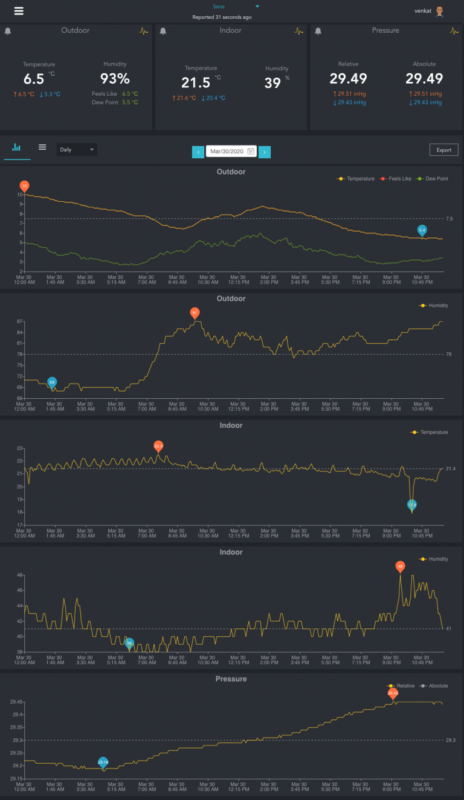
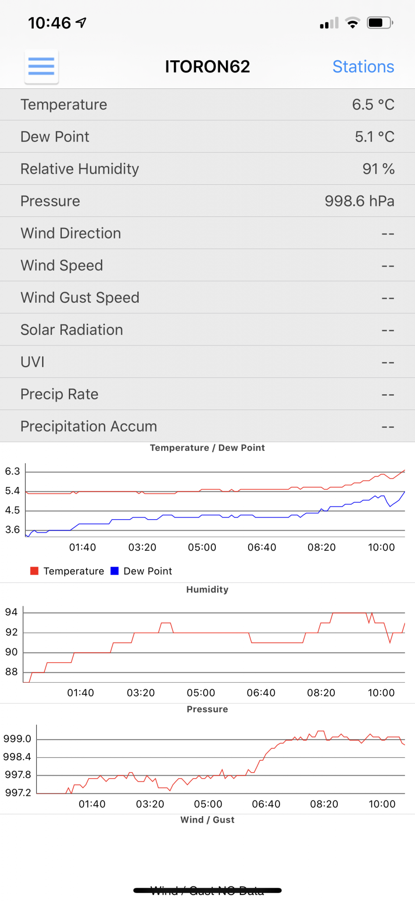

I was looking for a solution to monitor indoor and outdoor climate around my house. I purchased a <a href="https://www.netatmo.com/en-us/weather/weatherstation" target="_blank" rel="noreferrer noopener" aria-label="Netatmo kit  (opens in a new tab)">Netatmo kit </a>about three years ago and the outdoor sensor died a few months ago. I am also moving away from cloud controlled devices to locally managed hardware that can be integrated with Home Assistant. From the lessons learned using Netatmo, I set the following criteria for my new climate monitoring:<figure class="wp-block-gallery alignright columns-3 is-cropped">

**Off-cloud:** I should be able to manage and monitor locally. This means that I should have access to everything the device is capable of, without any feature crippling.  
**Integration:** My house runs on a Home Assistant platform. So, anything that I buy should integrate with this for improving the comfort and safety of my home through automations.  
**Extensible:** I wanted to start with something that is simple (temperature and humidity) and extend it to a rain, wind, air-quality and other measurements.  
**Easy to set up and power:** When it comes to climate monitoring there is no limit to spend and improve accuracy. Some of them require elaborate hardware rigs to mount and by extension, are difficult to power and expensive to maintain. I was looking for something simple and easy.  
**Accuracy:** The device should be reasonably accurate (see the previous point about high accuracy devices). It will be very useful to have option to adjust calibration. I have access to laboratory grade temperature, humidity, sound and gas sensors, that I can borrow over a weekend and compare the readings. If the device is capable of calibration adjustments, it will be very good.  
**Cost:** Home Automation is my hobby and I set limits on my spending. I want to maximize the number and capabilities of the devices without breaking my wallet. 

After elaborate search, I decided to invest in <a rel="noreferrer noopener" aria-label="Ecowitt GW1000 (opens in a new tab)" href="http://www.ecowitt.com/wifi_weather/80.html" target="_blank">Ecowitt GW1000</a>. This is a tiny kit that comes with a WiFi gateway and a 3-in1 indoor sensor that measures temperature, humidity, and barometric pressure. This was on sale for CDN$ 35 around christmas time (normally for CDN$ 42). I also purchased a <a rel="noreferrer noopener" aria-label="WH32  (opens in a new tab)" href="http://www.ecowitt.com/wifi_weather/94.html" target="_blank">WH32 </a>Outdoor temperature and humidity sensor along with it for CDN$ 19. 

The accompanying app WS View was easy to start, the interface does not look aesthetically pleasing, but is functional. I set up a Weather Underground account and it was easy to upload my data there and view thorough WU website and app. 

I also verified the calibration of temperature measurements using a NIST-traceable calibrated temperature measurement device and found the measurements within 0.4 C for both indoor and outdoor sensors. Overall I am very satisfied with this, having used this for three months. I have integrated this with WeeWx Weather monitoring and have taken this off-cloud. I am currently working on integrating this with Home Assistant and will write about these in the coming days.