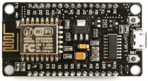

<a href="http://nodemcu.com/index_en.html" target="_blank" rel="noopener">NodeMcu ESP 8266</a> microcontroller boards are very cheap and have mini USB for connector for communication. However communicating to NodeMcu using Arduino IDE can be very frustrating. ESP8266 uses Silocon Labs CP210x for communication. Drivers for this are not available in Mac OS. (I am not sure about windows, they may also have the same issue).&nbsp; &nbsp; I scrambled around to find a solution for it.&nbsp; Anything that takes more than 10 min to figure out, I decided to write a blog so that it can save someone else&#8217;s time.&nbsp; &nbsp;So, here is the procedure.

Download the CP210x USB to UART Bridge Virtual COM Port (VCP) drivers from Silicon Labs ([link](https://www.silabs.com/documents/public/software/Mac_OSX_VCP_Driver.zip))

Install the usual way you would install the MacOS packages.

Since the new driver will modify the core communication at the OS, the system will alert you, you need to head to System Preferences and allow this driver to be installed.

Now, connect your NodeMcu board with USB cable and head&nbsp; back to the Arudino IDE and under Tools > Port.

You will see a new serial port added.&nbsp; Choose that.&nbsp; Set your baud rate to 115200, frequency as 80 MHz.

With this you should be able to communicate with your ESP 8266 NodeMcu board.

Note: The link above is for MacOS High Sierra.&nbsp; For other OS you may <a href="https://www.silabs.com/products/development-tools/software/usb-to-uart-bridge-vcp-drivers" target="_blank" rel="noopener">find links here</a>.
