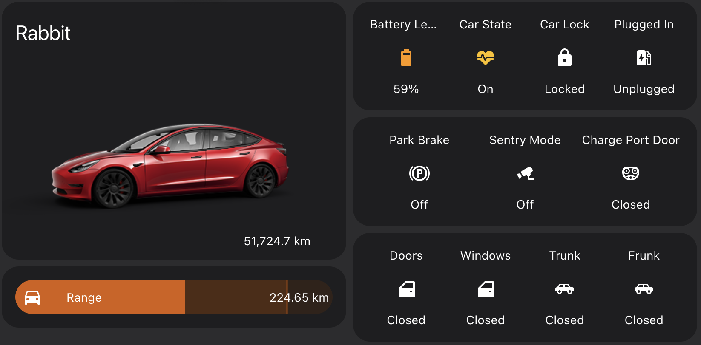

This section is currently being written

I use the [TeslaMate Addon](https://github.com/matt-FFFFFF/hassio-addon-repository/blob/main/teslamate/README.md) for Home Assistant following the installation notes in the Github page. This Home Assistant Addon is based on Adrian Kumpf's [TeslaMate](https://github.com/adriankumpf/teslamate).   Full installation instructions are available [here](https://docs.teslamate.org). 

Additional Home Assistant Addons such as Postgresql and Grafana are needed for database and visualizations. 

Once installed, MQTT sensors can be configured easily following these [configuration settings](https://docs.teslamate.org/docs/integrations/home_assistant#mqtt_sensoryaml-mqtt-sensor-section-of-configurationyaml).  On restarting, all these are available as entities that can be used in automations. 

### Automations

I was previously running a few automations, but scratched them. One of them was for Scheduled charging starting at midnights (to take advantage of the low Off-Peak Hour electricity rates).  However, the native charge scheduling through Tesla's iPhone App was more reliable. 

Another one was to automatically open the garage door (that uses the Chamberlein MyQ controller).  But getting geolocation fast near my home was unreliable as Tesla jumps between my cell phone thethering and connecting to home WiFi network.  The delay was annoying.  I currently disabled it, need to find an effective way of doing this. 

I am, however, using a script to alert me if Tesla is not plugged in by 7 pm to be ready for overnight charging.  This sends a notification to my cell phone.  You can find the automation [here](../../automations/tesla_plugged/).

