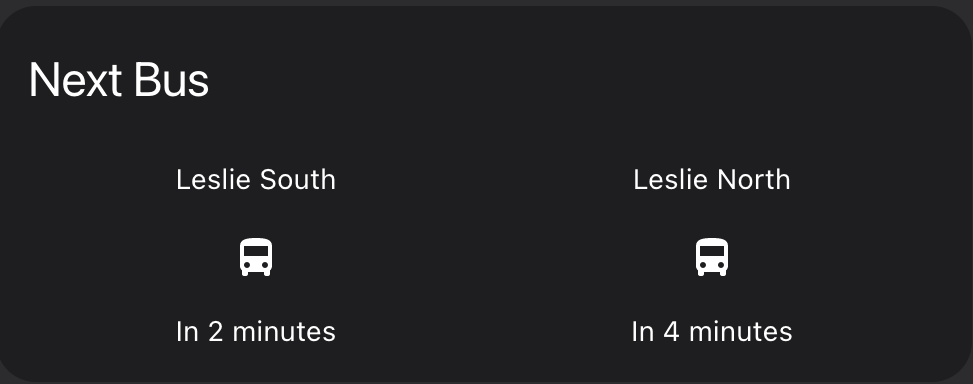

## Tesla

See [Tesla integration](../tesla) for full details

## NextBus 




[NextBus](https://www.home-assistant.io/integrations/nextbus/) integration provides the next arriaval time.  I have been using this for more than 3 years and with Toronto Transit Corporation (TTC) provided data, this works very reliably. 

``` yaml
- platform: nextbus
  agency: ttc
  route: 51
  stop: 14144
  name: Leslie North

- platform: nextbus
  agency: ttc
  route: 51
  stop: 14143
  name: Leslie South
```

## JuiceNet

This has to be written.